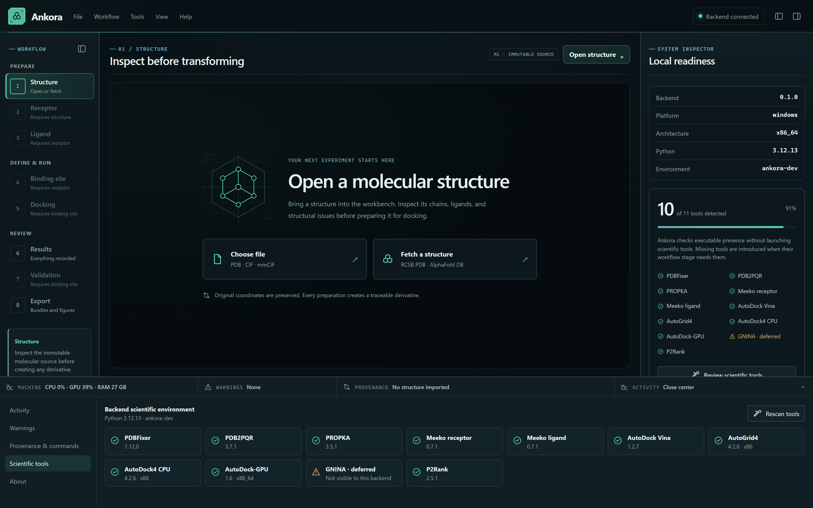
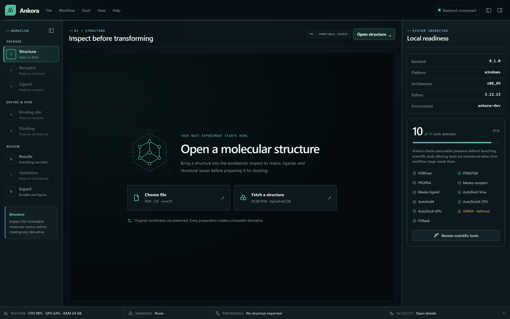
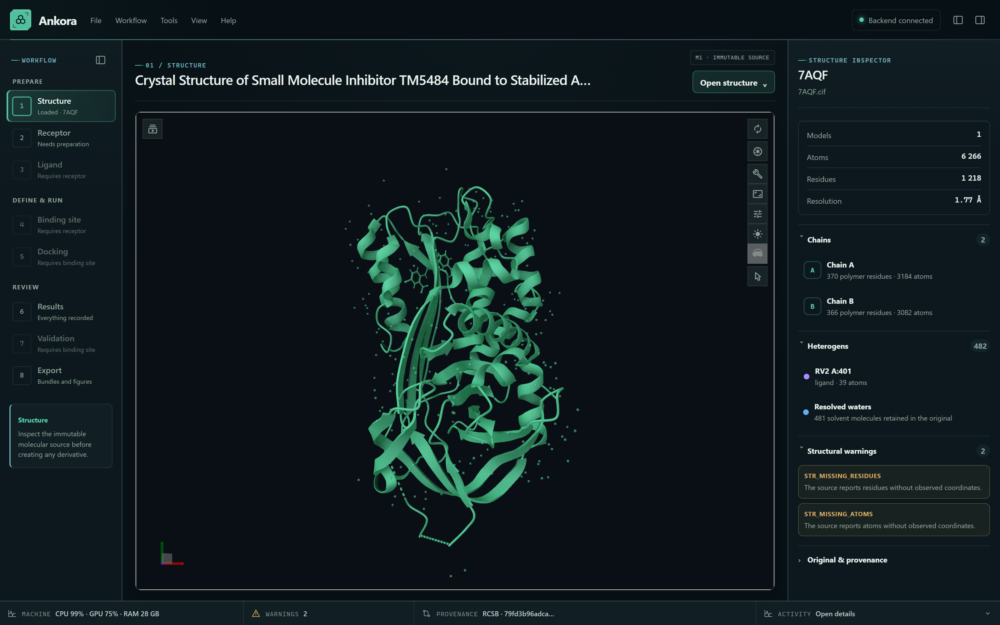
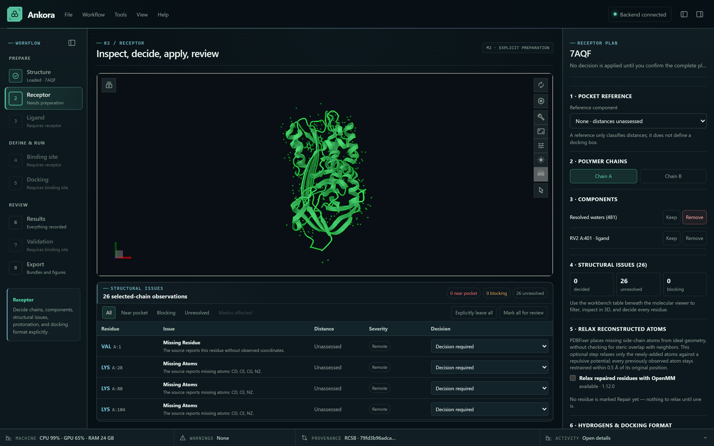
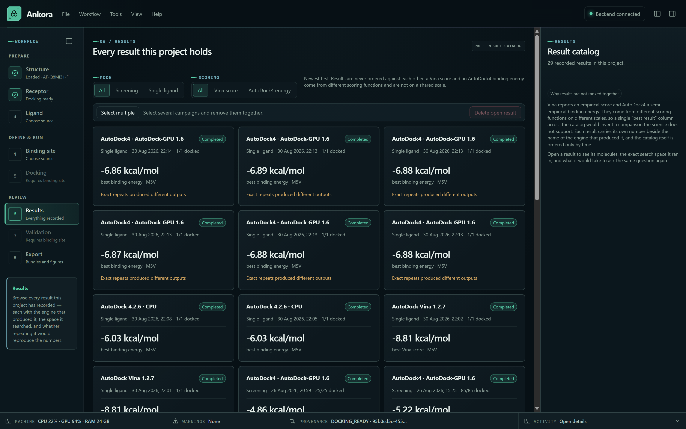
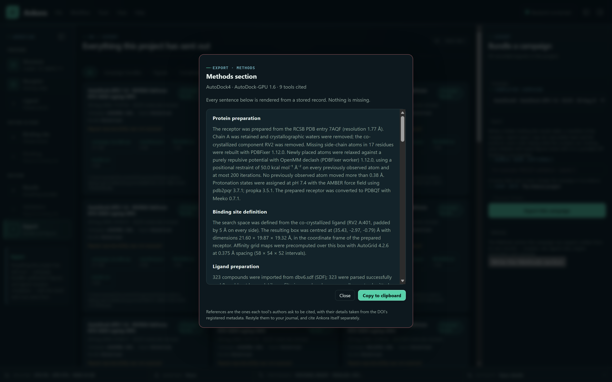
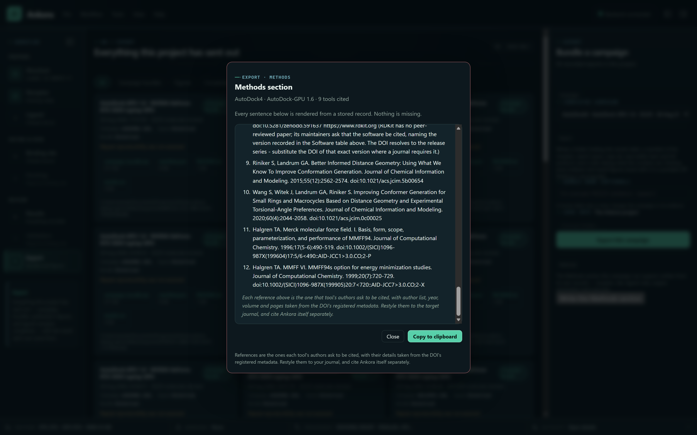

# Ankora — User guide

**Version 0.1.0 · Windows · Review draft, 2026-10-06**

This guide walks one complete docking campaign from a PDB accession to an
exported, citable record. It uses a published crystal structure and historical
Ankora records to explain what each result means. It is not yet a validated
clean-installer walkthrough or a promise of identical numbers on a fresh run.

The case is **SERPINE1 (PAI-1), PDB 7AQF**, redocking its co-crystallized
inhibitor **RV2**. It was chosen for a reason that will become clear in
[§6](#6-validation-did-the-engine-find-the-crystal-pose): both AutoDock backends
find the crystallographic pose and then rank the wrong one first. A guided tour
that only showed a clean result would teach you nothing about what this tool is
for.

> **Draft note for reviewers.** Most figures here are real captures of the
> current build. Six are still marked as pending and will be taken during the
> walkthrough that validates these steps against the shipped installer. Where
> the guide and the screen disagree, please tell us — that is useful feedback in
> itself. The numerical examples come from the
> [frozen SERPINE1 evidence matrix](https://github.com/Olascoaga/Ankora/blob/main/docs/validation/reference_cases/SERPINE1_7AQF_RV2.md).
> Its CPU run used neutral RV2; its Vina and GPU runs used anionic RV2. They
> are separate historical examples, not a controlled comparison of engines.

---

## Contents

1. [What Ankora is, and what it is not](#1-what-ankora-is-and-what-it-is-not)
2. [Before you start](#2-before-you-start)
3. [Structure → Receptor: preparing 7AQF](#3-structure--receptor-preparing-7aqf)
4. [Ligand: preparing RV2](#4-ligand-preparing-rv2)
5. [Binding site and docking](#5-binding-site-and-docking)
6. [Validation: did the engine find the crystal pose?](#6-validation-did-the-engine-find-the-crystal-pose)
7. [Results, interactions and figures](#7-results-interactions-and-figures)
8. [The Methods section](#8-the-methods-section)
9. [What Ankora will not do for you](#9-what-ankora-will-not-do-for-you)
10. [How to read a docking score](#10-how-to-read-a-docking-score)
11. [If something goes wrong](#11-if-something-goes-wrong)

---

## 1. What Ankora is, and what it is not

Ankora is a Windows workbench that runs **AutoDock Vina**, **AutoDock4** and
**AutoDock-GPU** through a guided interface, and records what it did precisely
enough to write your Methods section afterwards.

It does not implement a new scoring function or a new search algorithm. The
numbers come from the engines you already know. What Ankora adds is everything
around them: the original file is never modified, each chemical decision is made
by you and recorded, every artifact carries a SHA-256, and the campaign can be
exported as evidence somebody else can check.

The design rule behind every screen is a single sentence: **nothing is asserted
that was not recorded.** When Ankora cannot establish something, it says so
rather than filling the gap with a reasonable default.

---

## 2. Before you start

**Target platform:** Windows 11 x64.

**Required community experience:** install Ankora and start the supported
workflow. The complete installer must supply Python, preparation tools, Vina,
AutoGrid4, AutoDock4, AutoDock-GPU, P2Rank and its private Java runtime. No
separate tool installation, terminal commands or path configuration should be
required. See the
[complete-installer contract](https://github.com/Olascoaga/Ankora/blob/main/docs/architecture/ADR/ADR-024-complete-scientific-installer.md).

**October candidate:** complete packaging includes the independent docking
engines, P2Rank, private Java and offline WebView2 as well as the Python tools.
See the [dated acceptance record](validation/COMPLETE_WINDOWS_INSTALLER_2026-10-08.md).
Clean-machine acceptance and signing remain distinct release gates. The older
PDF edition and screenshots describe a configured development machine, not proof
of fresh-machine readiness.

### Installing

The Windows artifact is named `Ankora_0.1.0_x64-setup.exe`. Use only the exact
candidate supplied for review, with its matching checksum and release notes.
This guide does not assert that a signed public download is already available.

> **Candidate security status.** The last recorded installer candidate was
> unsigned. Windows or institutional policy may block it. Do not disable
> security controls to install Ankora; ask the maintainer for a verified,
> signed release or an approved testing arrangement.

On a configured review build, open **Tools → Scientific tool readiness** to
inspect available tools. Finding the AutoDock-GPU executable does not establish
GPU compatibility: execution also requires a supported device and driver.
CPU docking remains the path for machines without suitable GPU hardware;
choosing a different engine must remain explicit. The complete candidate
resolves its bundled tools automatically without manual path configuration.

*Figure 1. Tool readiness on the development machine, not a clean installation. GNINA is deferred and is not a supported engine in this version.*

### The workbench

The window has three parts: the **workflow** on the left — eight numbered steps in three
groups, *Prepare*, *Define & run* and *Review* —
the **workspace** in the middle, and the **inspector** on the right. The status
bar at the bottom shows machine load, warnings, provenance and background
activity.

Steps unlock as their inputs exist. You cannot dock before there is a receptor,
a ligand and a box — not as a restriction, but because a docking run without
those is not a defined experiment.

*Figure 2. Workflow at left, workspace in the centre, inspector at right, and status bar below.*

---

## 3. Structure → Receptor: preparing 7AQF

### 3.1 Import the structure

Step **1 · Structure**. Choose **Fetch a structure** (RCSB PDB · AlphaFold DB), type `7AQF` and confirm.

Ankora downloads the deposited mmCIF, hashes it, and inspects it **without
changing a single coordinate**. You should see:

| | |
|---|---|
| Method | X-RAY DIFFRACTION |
| Resolution | 1.77 Å |
| Models | 1 |
| Atoms | 6266 |
| Residues | 1218 |
| Missing residues | 22 |
| Missing atoms | 123 |

This file is now immutable. Everything from here on is a *derivative* that
points back at it by identity and hash.

*Figure 3. Imported 7AQF. The deposited mmCIF has SHA-256 `79fd3b96adca…`; its coordinates remain unchanged.*

### 3.2 Make the receptor

Step **2 · Receptor**. Complete the explicit preparation plan before applying
it. The following describes this example, not a universal preparation recipe.

1. **Chains.** Keep **A** only.
2. **Waters.** Remove them.
3. **Components.** Remove `RV2 A:401` — the co-crystallized inhibitor. We will
   dock it back in later, so it must not be in the receptor.
4. **Structural issues.** Review each issue. The historical receptor repaired
   17 observed residues with missing heavy atoms; absent residues were not
   modelled. Use the recorded per-residue decisions to reproduce that plan,
   not a blanket removal of every warning.
5. **Repair and protonation.** For the selected repairs, enable restrained
   relaxation and protonation at **pH 7.4** with the **AMBER** force field.
   Resolve blocking issues, analyze the PROPKA proposals, review residue
   states and confirm the explicit protonation choices before applying.

*Figure 4. A receptor plan in progress: chain A, water and RV2 decisions, and structural issues. This is not the final accepted plan.*

Press **Apply explicit preparation plan**. Ankora runs, in order: PDBFixer for
explicitly selected repairs, a restrained OpenMM relaxation
(50.0 kcal mol⁻¹ Å⁻² positional restraint, at most 200 iterations), PDB2PQR with
PROPKA for protonation, and Meeko to write the PDBQT.

Watch the **Activity** centre: each tool reports its own version, and each output
is hashed as it is written. When it finishes the receptor is marked
`docking_ready`.

> **Why the relaxation is restrained.** Rebuilt side chains can clash. Relaxing
> without restraints could displace experimentally observed coordinates.
> Ankora restrains previously observed atoms; they are not perfectly frozen.
> It measures their largest displacement and enforces the configured drift
> limit. This is local clash relief, not molecular dynamics or equilibration.

---

## 4. Ligand: preparing RV2

Step **3 · Ligand**. Ankora can take a ligand from a file, a SMILES string, a
library — or, as here, **extract it from the crystal**.

### 4.1 Extract

Choose **From the imported structure**, select `RV2 A:401`. Ankora extracts it
with its deposited 3D coordinates and assigns stereochemistry from those
coordinates rather than guessing:

| | |
|---|---|
| Formula | C₁₉H₁₃ClN₂O₅ |
| Formal charge | 0 |
| Heavy atoms | 27 |
| Molecular weight | 384.78 g/mol |

### 4.2 Choose a protonation state — explicitly

Protonation is a scientific choice, not just a file-format conversion.

Open **Protonation states** and enumerate at **pH 7.4**. Dimorphite-DL 2.0.2
returns one candidate for RV2 at that pH:

> **C₁₉H₁₂ClN₂O₅⁻**, formal charge **−1**

Ankora will not adopt it until you confirm. It is a different chemical state of
the same parent compound — different hydrogen-bond donors, different Meeko
atom typing, and in AutoDock4 a different electrostatic term. Select it and
confirm.

> **[Figure pending]** The neutral extracted state and pH 7.4 anion in the protonation panel.

> **If you retain the imported state**, the neutral RV2 state is prepared.
> That is an explicit choice to justify scientifically, not evidence that the
> neutral state dominates at pH 7.4. The Methods section records it.

### 4.3 Generate and minimize a conformer

Press **Generate conformer**. Ankora embeds a pool of 20 conformers with
**ETKDGv3**, minimizes them with **MMFF94s** (up to 500 iterations), and asks you
to confirm the result. Recorded for this case: seed **20260819**, conformer
**4** selected, final MMFF energy **49.21 kcal/mol**. These are the historical
anionic-state values, not an acceptance target for a changed tool version.

The coordinates are generated **independently of the deposited ones**. This
matters for redocking: independent starting coordinates reduce bias from
reusing the reference geometry as the search input.

Finally, **Prepare PDBQT** — Meeko 0.7.1, Gasteiger partial charges.

---

## 5. Binding site and docking

### 5.1 The box

Step **4 · Binding site**. Choose **From co-crystallized ligand**, pick
`RV2 A:401`, padding **5.0 Å**. Ankora computes the box from the ligand's
observed heavy-atom extent:

| Centre (Å) | Size (Å) |
|---|---|
| 35.4305, −2.9670, −0.7905 | 21.597 × 19.870 × 19.317 |

The box is editable and shown live in the 3D viewer. Once confirmed it becomes
an immutable record — if you later change the receptor, every binding site that
depended on it is marked stale rather than silently reused.

> **[Figure pending]** The co-crystal box around RV2 in the binding-site workspace.

### 5.2 Dock with Vina

Step **5 · Docking**. Choose **Single ligand** and **AutoDock Vina 1.2.7**.
Recorded parameters:

| | |
|---|---|
| Exhaustiveness | 8 |
| Modes | 9 |
| Minimum inter-mode RMSD | 1.0 Å |
| Energy range | 3.0 kcal/mol |
| Seed | 20260823 |

Confirm the exact inputs and start docking. Screening progress is reported per
molecule; a single-ligand job reports its execution state rather than a
fabricated intra-molecule percentage. The run is cancellable, and if
the machine stops mid-run the next launch preserves the interrupted attempt
instead of pretending it never happened.

**Recorded result: 9 poses, best Vina score −7.073 kcal/mol.**

> **[Figure pending]** Vina execution and completion during the validated walkthrough.

### 5.3 Optionally, the AutoDock4 family

AutoDock4 and AutoDock-GPU need precomputed affinity maps. Ankora runs AutoGrid4
once (0.375 Å spacing, 58 × 54 × 52 grid intervals for this box, with one more
node along each axis) and can **reuse a compatible map set** for both backends.
Reuse requires matching receptor, search geometry, atom types and map protocol.

The frozen historical examples used different ligand states:

| Engine | RV2 formal charge | Output | Best score (kcal/mol) |
|---|---|---|---|
| Vina 1.2.7 | -1 (anion) | 9 poses | -7.073 |
| AutoDock4 CPU 4.2.6 | 0 (neutral) | 10 runs | -4.96 |
| AutoDock-GPU 1.6 | -1 (anion) | 10 runs | -5.70 |

The CPU example did not use the anionic conformer prepared in §4. These records
illustrate interpretation; they are not a matched-input engine benchmark.

> **Do not combine these numbers.** A Vina score and an AutoDock4
> binding energy come from different scoring functions. Ankora will show them
> side by side and will never merge them into a combined ranking.

---

## 6. Validation: did the engine find the crystal pose?

This is the section worth reading twice.

Step **7 · Validation** compares a docked pose against the crystallographic
ligand using **symmetry-aware heavy-atom RMSD, computed in place** — the pose is
*not* superimposed first. Superimposing would measure whether the shapes match;
we want to know whether the atoms are where the crystal says they are.

> Aligning the ligand alone can hide an incorrect placement in the pocket.
> Ankora therefore evaluates placement in the receptor's coordinate frame.

Run validation against the extracted RV2 reference. The historical verdicts
below used the different chemical states listed in §5.3 and a recorded 2.0 Å
threshold. This evidence set does not contain a Vina RMSD verdict.

| | AutoDock4 CPU | AutoDock-GPU |
|---|---|---|
| Top-ranked pose RMSD | **3.139 Å** | **10.717 Å** |
| Best pose found, any rank | 0.454 Å | 1.331 Å |
| First rank that recovers | 2 | 2 |
| Poses within threshold | 6 of 10 | 9 of 10 |
| Sampling | ✅ success | ✅ success |
| Ranking | ❌ **failure** | ❌ **failure** |
| Outcome | `recovered_but_misranked` | `recovered_but_misranked` |

**Read that carefully.** Both engines *found* the crystallographic pose — 0.45 Å
is an excellent reproduction. Both then ranked a wrong pose first. If you had
taken the top-ranked result and moved on, as most workflows invite you to do, you
would have carried a 3.1 Å (or 10.7 Å) pose into your interpretation.

Ankora separates **sampling** from **ranking** and reports both, because they
fail independently and they mean different things. A tool that reported only
"RMSD = 3.139 Å, failed" would have hidden the fact that the search worked and
the scoring function did not.

> **[Figure pending]** The per-pose RMSD table and validation verdict.

> **On reproducibility.** A seed alone does not establish reproducibility.
> Read the exact-repeat evidence attached to the selected result. For example,
> the separate [6OCO/M5V validation](https://github.com/Olascoaga/Ankora/blob/main/docs/validation/PIK3CD_6OCO_M5V_EXECUTION.md)
> measured a 0.03 kcal/mol best-energy range across six GPU repeats and
> different cluster memberships. That observation is case-specific; it is not
> a universal GPU error bar or a guarantee of CPU bitwise identity elsewhere.

---

## 7. Results, interactions and figures

Step **6 · Results** lists recorded campaigns, including failed or interrupted
attempts, with each
engine, receptor, site and counts. Open the Vina result and select the top pose.

*Figure 5. A project with several recorded campaigns. Different scoring functions are not merged into one ranking.*

**Analyse interactions** runs ProLIF 2.2.1 over that exact pose against the exact
prepared receptor, under the recorded profile `ankora-default-v1` (6.0 Å vicinity
cutoff). The historical Vina top pose has **17 geometric contacts**. That
particular job is preserved in the reference project's recoverable Trash;
a fresh project will not contain it. Analyze the pose from your own run,
without expecting the same count after changing preparation or versions.

You get three linked views of the same structured record — a 2D interaction
diagram drawn by Ankora, a contact table, and the pose in Mol* with the
contacting residues focused. Clicking a contact in one highlights it in the
others.

> **[Figure pending]** The 2D diagram, contact table and 3D interaction view.

From here you can save the 2D diagram as SVG, PNG, TIFF or PDF; the 3D view
supports PNG, TIFF or PDF, not SVG. You can also export the
exact ligand–receptor complex as a PDB for other viewers. You choose the
destination folder; Ankora never overwrites an existing file, and suffixes a
taken name the way Windows does.

> **What an interaction diagram is.** It is a geometric interpretation of one
> pose. It is not experimental evidence, not an energy decomposition, and not
> proof that a contact is favourable.

---

## 8. The Methods section

In **6 · Results**, select your result and use **Write the Methods section**
in its inspector. This also supports the single-ligand example. For screening
campaigns, the same report is available in **8 · Export**.

> **[Figure pending]** The Export workspace on the clean review installation,
> with a shareable destination and no personal machine paths.

Ankora reads the provenance chain and writes the Methods text the campaign's own
records support — the PDB entry and its resolution, the chains kept, the repair
and relaxation parameters with the measured maximum displacement, the pH and
force field, the box centre and dimensions, the embedding and minimization
protocol, the charge model, the complete engine parameters, the executable's
SHA-256, and the counts.

Three things about that text are worth noticing.

**It marks what it cannot support.** A missing artifact becomes a visible
`[not recorded: …]` marker in the prose and an entry in the gap list shown above
it. It is never replaced by a plausible sentence.

**It states what was not done.** If no pH-based protonation enumeration was
recorded, the text says so explicitly. Your receptor section will name a pH; if
the ligand section stayed silent a reader would reasonably assume the same pH
applied. That silence would flatter the work, so Ankora breaks it.

**It carries the references.** The Software table lists every tool, its version,
its role and a numbered reference from Ankora's recorded bibliography. Review
these citations and the Methods text before including them in a manuscript.

Press **Copy to clipboard** and paste into your manuscript. What you get is the
Markdown source, headings and table included.

*Figure 6. An illustrative 323-compound library campaign using the 7AQF receptor. This is not the single-ligand RV2 protocol described above.*

*Figure 7. The same dialogue scrolled to the recorded references.*

The **campaign bundle** (also in step 8) is the portable version of the same
idea: a ZIP with the manifest, results table, existing interaction analyses and
saved figures where available, and an integrity index. Inspect the bundle's
file list before using it as supplementary material; it is not a promise to
include every raw pose from a campaign. Export the exact pose complex when
you need that coordinate file.

---

## 9. What Ankora will not do for you

This list is the product, not a disclaimer.

- **It will not choose a protonation state silently.** If you do not enumerate,
  the imported state is used and the Methods text says so.
- **It will not enumerate tautomers unless you ask.** Tautomer enumeration is
  available for screening microstates and is off by default; when it is off, the
  Methods text records that too.
- **It will not merge scores from different engines.** No combined ranking, no
  consensus score.
- **It will not call a score an affinity**, or claim a biological result.
- **It will not rank the candidate protonation or tautomer states it generates.**
  Neither Dimorphite-DL nor RDKit provides a population model that would justify
  reading the order as a preference, so the order is reported as unranked.
- **It will not modify your imported file**, ever.
- **It will not quietly reuse a stale derivative.** Change a receptor and
  everything downstream is marked stale.
- **It will not claim reproducibility it did not measure.** A campaign with no
  exact repeat reports "not assessed" — which is different from "not
  reproducible".

---

## 10. How to read a docking score

A short section, because this is where results get over-interpreted.

A Vina score and an AutoDock4 binding energy are **computational estimates from
empirical scoring functions**, reported in kcal/mol. They are not measured
binding affinities and they do not convert to one. The number's useful job is
*rank-ordering ligands against one target*; it is much weaker at comparing
across targets, and it is not a prediction of activity.

§6 is the concrete lesson: on this system the scoring function ranked a 3.1 Å
pose above a 0.45 Å one. Sampling and scoring are different problems and they
fail separately.

Practical consequences:

- Do not compare a Vina score to an AutoDock4 binding energy.
- Do not read small differences between ligands as meaningful ordering.
- Inspect poses. A good score on a chemically implausible pose is a scoring
  artifact, and the interaction view exists to make that visible.
- Where a co-crystal exists, redock it first (§6). If the engine cannot rank the
  known pose first on your target, treat its ranking on unknown ligands with
  matching scepticism.

---

## 11. If something goes wrong

| Symptom | What it means |
|---|---|
| **Tools missing** | Open Tools → Scientific tool readiness and rescan. Report missing tools in a complete-installer candidate as an installation defect, not a request to configure paths yourself. Earlier backend-only candidates are incomplete. |
| **A step is greyed out** | Its inputs do not exist yet. The workflow panel names what is missing. |
| **"stale" badge on a derivative** | Something upstream changed. Recreate it; Ankora will not silently reuse it. |
| **A run was interrupted** | The next launch preserves the partial attempt as an explicit interrupted record. Retrying starts a new identity rather than appending to partial evidence. |
| **Port 8765 in use** | Another local process owns the port. Close a previous Ankora session if it is yours; do not terminate an unidentified process. |
| **Warnings badge is lit** | Read each finding and its required action. Some need a scientific decision; a preparation blocker cannot be ignored. |

Logs live beside the project data; the **Provenance** panel in the status bar
shows every command Ankora issued, with its arguments.

---

## Citing Ankora

If Ankora contributed to published work, cite it using the metadata in
`CITATION.cff` at the repository root, naming the version that produced your
results. Cite the scientific tools separately — the Methods section Ankora
generates lists them with their references.

## Telling us what is wrong

This guide and the software are both early. The most useful thing you can send
back is the point at which you stopped, and why.

---

*Ankora 0.1.0 · MIT licence · github.com/Olascoaga/Ankora*
